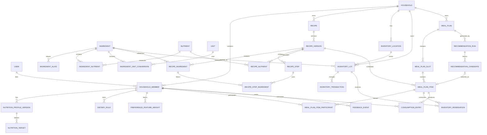

# 智能营养食谱与冰箱库存系统

## PRD、ER 数据模型、推荐规则与接口契约 v0.2

本文档按“可进入产品、架构和研发联合评审”的粒度设计。当前不包含具体代码、数据库迁移脚本或完整 OpenAPI 文件。

### v0.2 决策与修订记录（2026-07-21）

- 首发形态确认为移动优先的响应式 Web/PWA；暂不开发原生 App 和微信小程序。
- 首期以邀请制真实 MVP 为目标，先交付登录、家庭成员、菜谱、库存、手工周计划、单餐推荐、完成烹饪和库存扣减的垂直闭环。
- 验收版增加应用内用户名密码注册、普通用户登录和管理员登录；首个注册账户自动成为平台管理员，生产认证仍预留手机号和微信认证适配层。
- 初期只为健康成年人提供系统估算；儿童、孕妇、老人及特殊疾病人群仅使用人工或专业人员目标。
- 首期营养与菜谱采用明确标注的演示数据，正式发布前必须替换为具有合法授权和可追溯版本的数据源。
- MVP 增加基础购物清单；PWA 支持安装和离线查看最近数据，写操作要求联网，临期提醒先采用站内提醒。
- 产品名称确认为“快乐厨房”，视觉方向为温暖、清爽、家庭化的绿色与橙色。
- 推荐默认参数全部进入版本化配置，不得硬编码在业务流程中。
- 将“菜谱—库存差额—采购清单”提升为下一阶段 P0 闭环；将详细菜谱编辑、网页导入、PDF/EPUB 导入与人工校对提升为明确研发任务，不再仅作为模糊的后续能力。

---

# 0. 已冻结的产品基线

## 0.1 默认产品形态

- 以“家庭”为租户边界，一个家庭包含多个成员。
- 家庭成员不一定拥有登录账号，例如儿童、老人或由管理员代管的成员。
- 首期提供响应式 Web/PWA，中文为首要语言。
- 系统同时维护：
  - 计划摄入；
  - 实际摄入；
  - 冰箱库存；
  - 用户偏好；
  - 食材保质期。
- 所有核心营养计算以克为标准基准，展示层可转换为个、勺、杯、毫升等厨房单位。
- 菜谱、营养档案、推荐配置均需要版本化。
- 大语言模型只能用于菜谱解析、文案和推荐理由，不参与营养加总、过敏判断、库存扣减和保质期判断。
- 系统不提供疾病诊断或医疗膳食处方。特殊人群的营养目标必须允许人工录入，并优先于系统估算。

## 0.2 MVP 范围

MVP 必须覆盖：

1. 多成员每日营养需求。
2. 菜谱新增、编辑、软删除、恢复。
3. 精确食材用量和完整步骤。
4. 冰箱库存批次和保质期。
5. 单餐推荐和整周食谱生成。
6. 用户喜欢、不喜欢、删除、替换等反馈。
7. 用户删除周计划中的菜后动态给出替代项。
8. 每位成员独立份量和营养统计。
9. 烹饪完成后按先到期先使用原则扣减库存。
10. 推荐原因、营养缺口和风险提示。
11. 根据计划缺口生成、勾选和手工维护基础购物清单。
12. 登录、受邀加入家庭和多家庭切换。
13. 站内临期提醒和库存异常提醒。

MVP 暂不包含：

- 自动识别冰箱照片中的全部食材；
- 外卖或电商直接下单；
- 社交社区；
- 医疗诊断；
- 自动生成未经校验的营养数据；
- 复杂预算优化；
- 与可穿戴设备深度集成。

---

# 1. 详细 PRD

## 1.1 产品目标

系统应帮助家庭在以下四个目标之间取得平衡：

1. **满足营养需求**：尽可能缩小每位成员的每日和每周营养偏差。
2. **符合个人口味**：根据显式偏好和历史行为动态调整。
3. **减少食物浪费**：优先使用临期、已开封和库存较多的食材。
4. **降低决策成本**：提供可执行的菜谱、准确用量、每人份量和周计划。

系统不是单纯的“菜谱搜索工具”，而是一个持续感知用户、库存和计划变化的家庭饮食决策系统。

## 1.2 用户角色

| 角色 | 权限 |
|---|---|
| 家庭所有者 | 管理家庭、成员、权限、家庭设置和全部数据 |
| 家庭管理员 | 管理成员档案、菜谱、库存和周计划 |
| 普通成员 | 管理自己的偏好、反馈和实际摄入；按权限编辑共享菜谱和计划 |
| 受管成员 | 无登录账号，由管理员维护营养目标、偏好和实际摄入 |
| 只读成员 | 查看周计划、菜谱和库存，不可修改 |

一个登录用户可以加入多个家庭；一个家庭成员记录可以没有登录用户。

## 1.3 核心术语

| 术语 | 定义 |
|---|---|
| 食材 | 标准化后的食品概念，例如“鸡蛋”“番茄”“鸡胸肉” |
| 商品 | 带品牌、包装和条码的具体食品，例如某品牌 250ml 牛奶 |
| 库存批次 | 某次购买或录入的一批食材，具有独立数量和到期日期 |
| 菜谱版本 | 菜谱某次编辑后的不可变快照 |
| 餐次槽位 | 某一天的早餐、午餐、晚餐、加餐等计划位置 |
| 计划项 | 餐次槽位中的一道菜 |
| 营养目标 | 某成员在一天或一周内某营养素的目标范围 |
| 计划摄入 | 根据周计划计算出的预计营养 |
| 实际摄入 | 用户实际记录或确认吃掉的食物营养 |
| 硬约束 | 任何情况下都不能放宽的安全或用户禁忌 |
| 软约束 | 无法全部满足时可产生偏差，但必须向用户说明 |

---

# 2. 功能需求

## FR-01 家庭与成员管理

### 功能

- 创建家庭。
- 邀请具有登录账号的成员。
- 创建无登录账号的受管成员。
- 设置姓名、头像、出生日期、身高、体重、活动水平、时区和个人状态。
- 配置成员是否参与早餐、午餐、晚餐或加餐。
- 设置成员是否允许单独替代餐。

### 验收标准

- 家庭数据必须严格隔离。
- 一个成员退出家庭后，不得继续访问家庭数据。
- 历史周计划必须继续显示退出成员当时的名称和份量快照。
- 管理员修改成员营养目标后，只影响未来或未锁定的计划，不追溯修改历史记录。

## FR-02 营养档案与目标

### 功能

每位成员可设置：

- 每日能量目标；
- 蛋白质、脂肪、碳水化合物；
- 膳食纤维；
- 钠、糖、饱和脂肪等上限；
- 可选微量营养；
- 每餐目标比例；
- 目标来源：
  - 系统估算；
  - 用户手工设置；
  - 专业人员提供；
- 生效日期；
- 特殊说明。

### 业务规则

- 人工设置和专业人员设置优先于系统估算。
- 每次修改生成一个新的营养档案版本。
- 推荐运行必须记录使用了哪个营养档案版本。
- 营养目标支持：
  - 最低值；
  - 目标值；
  - 最高值；
  - 仅最低值；
  - 仅最高值。
- 某些营养素可以被用户标记为“硬上限”，但默认营养目标均作为软约束处理。

### 验收标准

- 当用户修改今日已摄入数据时，系统应重新计算今日剩余营养缺口。
- 推荐结果必须显示“计划后预计达到目标的百分比”。
- 系统不得把营养数据不完整的菜谱标记为“满足营养目标”。

## FR-03 饮食限制与安全规则

### 支持的规则

- 过敏原；
- 宗教或伦理饮食限制；
- 素食、纯素、无麸质等饮食模式；
- 永久排除食材；
- 永久排除菜谱；
- 临时不想吃的菜；
- 软性不喜欢食材；
- 最大辣度；
- 不使用某类厨具；
- 最大烹饪时间。

### 规则级别

| 级别 | 行为 |
|---|---|
| HARD | 候选生成阶段直接排除 |
| STRONG_NEGATIVE | 保留但大幅降权 |
| SOFT_NEGATIVE | 轻度降权 |
| POSITIVE | 提升推荐分 |
| TEMPORARY | 在指定日期范围内生效 |

### 验收标准

- 任一参与该餐的成员存在过敏或硬禁忌时，该菜不能作为家庭共享菜。
- 若允许单独替代餐，可为该成员生成独立菜品。
- 任何推荐解释不得掩盖硬约束冲突。

## FR-04 食材和营养基础数据

### 食材需要包含

- 标准名称；
- 别名；
- 分类；
- 可食比例；
- 标准营养值；
- 营养数据来源和版本；
- 常见厨房单位；
- 单位换算；
- 密度或单个平均重量；
- 过敏原标签；
- 数据置信度。

### 关键规则

- “番茄”“西红柿”“tomato”等应解析到同一标准食材。
- 营养计算统一转换为克。
- 数量型单位必须有针对具体食材的换算，例如：
  - 1 个鸡蛋约多少克；
  - 1 个洋葱约多少克。
- 未配置换算的自由文本单位不能用于自动营养计算。

### 数据完整性状态

| 状态 | 含义 |
|---|---|
| COMPLETE | 用量、换算和营养均完整，可进入推荐 |
| PARTIAL | 可展示或手工加入计划，但自动推荐时降权或排除 |
| UNRESOLVED | 存在无法识别的食材或单位，不参与自动推荐 |
| VERIFIED | 经过人工或可信数据源校验 |

## FR-05 菜谱管理

### 菜谱字段

- 标题；
- 描述；
- 图片；
- 标准份数；
- 成品总重量；
- 准备时间；
- 烹饪时间；
- 难度；
- 菜系；
- 餐次；
- 口味；
- 厨具；
- 每项食材准确数量；
- 完整步骤；
- 步骤与食材关联；
- 每份和整份营养；
- 过敏原；
- 来源；
- 可见范围。

### 功能

- 手工新增菜谱；
- 编辑菜谱；
- 软删除和恢复；
- 复制菜谱；
- 修改份数；
- 查看历史版本；
- 将家庭菜谱设置为私人或家庭共享；
- P0 提供快速手工录入：批量粘贴食材、逐行填写用量和单位、拖动步骤顺序、将步骤关联到食材；
- P1 支持从网页 URL、Schema.org Recipe JSON-LD、结构化 JSON 和纯文本导入；
- P1 支持上传 PDF、EPUB 并异步提取一个或多个候选菜谱；扫描型 PDF 进入 OCR 分支；
- 所有自动导入结果必须先进入“待确认草稿”，经用户校对食材、用量、单位和步骤后才能发布；
- 导入器采用适配器接口，允许后续接入开源解析器或外部解析服务。

### 版本规则

- 每次编辑创建新的不可变菜谱版本。
- 已存在的周计划继续引用旧版本，避免营养和用量被悄然改变。
- 新推荐默认使用最新有效版本。
- 删除菜谱只删除菜谱库入口，不删除历史计划和历史摄入记录。

### 验收标准

- 修改菜谱份数后，所有食材和营养应按相同比例重新计算。
- 数量计算使用高精度小数，展示阶段再舍入。
- 若某食材无法转换为标准重量，界面必须显示警告。
- 用户可手工将不完整菜谱加入计划，但系统不得声称其营养数据精确。
- 导入结果不得直接标记为数据完整；无法识别的食材、用量、单位或步骤必须逐项标记并要求人工确认。
- 文档导入必须记录文件来源、页码或章节定位、解析器版本和用户确认状态。

## FR-06 冰箱库存管理

### 库存按批次记录

每个批次包含：

- 食材或商品；
- 剩余数量；
- 原始单位；
- 标准数量；
- 购买日期；
- 开封日期；
- 最佳食用日期；
- 安全食用截止日期；
- 储存位置；
- 批次号；
- 价格；
- 数据来源；
- 状态。

### 到期类型

| 类型 | 系统行为 |
|---|---|
| USE_BY 安全截止日期 | 日期过后禁止自动推荐和自动扣减 |
| BEST_BEFORE 最佳食用日期 | 默认过期后不自动推荐，可由家庭设置允许人工确认 |
| OPENED_SHELF_LIFE 开封后保质期 | 根据开封日期动态计算 |
| NONE | 不参与临期评分 |

### 库存操作

- 采购入库；
- 手工增加或减少；
- 消耗；
- 丢弃；
- 盘点；
- 预留；
- 释放预留；
- 批次转移；
- 修改到期日期。

### 关键规则

- 消耗默认采用 FEFO：先到期先使用。
- 同一食材可以同时存在多个批次。
- 库存数量不得为负数，除非管理员明确执行带原因的盘点纠正。
- 用户应能查看：
  - 今日到期；
  - 3 天内到期；
  - 7 天内到期；
  - 已开封；
  - 已过最佳食用日期；
  - 已过安全日期。

## FR-07 单餐推荐

### 输入

- 家庭和参与成员；
- 日期与餐次；
- 今日实际摄入；
- 已锁定的后续餐；
- 成员营养目标；
- 饮食禁忌；
- 偏好权重；
- 当前库存；
- 临期批次；
- 最近吃过的菜；
- 可接受烹饪时间；
- 厨具；
- 可购买缺失食材的程度。

### 输出

每个推荐项必须包含：

- 菜谱；
- 总制作份数；
- 每位成员份数；
- 精确食材用量；
- 预计库存消耗；
- 缺失食材；
- 每位成员营养贡献；
- 总推荐分；
- 各评分分量；
- 2 至 4 个可解释推荐原因；
- 风险或数据不足提示。

### 验收标准

- 正常情况下返回至少 3 个候选。
- 候选不足时返回明确原因，而不是返回不安全菜谱。
- 过敏、硬禁忌和过安全截止日期的食材不得出现在候选中。
- 相同输入快照、相同规则版本和相同随机种子必须可复现。

## FR-08 周食谱计划

### 功能

- 按周展示。
- 支持早餐、午餐、晚餐、加餐。
- 支持一天多个菜。
- 支持家庭共享菜和个别成员替代菜。
- 支持拖拽移动。
- 支持锁定和解锁。
- 支持手工添加菜谱。
- 支持删除计划项。
- 支持替换推荐。
- 支持重新优化整周。
- 显示每天和每周营养汇总。
- 显示预计使用的临期食材。
- 显示缺失食材和预计采购量。

### 计划状态

| 状态 | 含义 |
|---|---|
| DRAFT | 用户手工创建，尚未生成 |
| GENERATING | 推荐计算中 |
| READY | 已生成，可编辑 |
| PARTIALLY_ACCEPTED | 部分菜已锁定或确认 |
| STALE | 库存或目标变化导致部分结果过期 |
| COMPLETED | 一周结束且已处理 |
| ARCHIVED | 历史归档 |

### 计划项状态

| 状态 | 含义 |
|---|---|
| SUGGESTED | 系统推荐，未确认 |
| ACCEPTED | 用户接受 |
| LOCKED | 后续优化不得修改 |
| MANUAL | 用户手工添加 |
| REPLACED | 被其他菜替换 |
| REMOVED | 中性删除 |
| REJECTED | 带负反馈删除 |
| COOKED | 已烹饪 |
| SKIPPED | 最终未制作 |

### 验收标准

- 删除某个计划项不得删除菜谱库中的菜谱。
- 编辑菜谱不得自动修改已存在的计划项版本。
- 重新优化时不得改变已锁定计划项。
- 动态调整应尽量减少不相关计划项的变化。
- 计划生成失败时必须返回冲突原因和放宽建议。

## FR-09 删除、替换和动态调整

### 删除类型

1. **中性移除**
   - 用户只是修改本周计划；
   - 不视为不喜欢；
   - 不显著影响长期偏好。

2. **拒绝推荐**
   - 用户选择原因；
   - 更新相应偏好特征；
   - 返回替代项。

### 拒绝原因

- 不喜欢味道；
- 不喜欢主要食材；
- 太辣；
- 烹饪时间太长；
- 最近吃过；
- 缺少食材；
- 今天不想吃；
- 份量不合适；
- 其他。

### 不同原因的学习行为

| 原因 | 更新对象 |
|---|---|
| 不喜欢味道 | 菜谱、口味、烹饪方式 |
| 不喜欢主要食材 | 主要食材特征 |
| 太辣 | 辣度特征 |
| 时间太长 | 烹饪时间偏好 |
| 最近吃过 | 短期重复惩罚，不影响长期口味 |
| 缺少食材 | 不影响口味，只影响库存覆盖偏好 |
| 今天不想吃 | 短期抑制 |
| 份量不合适 | 份量模型 |
| 其他 | 仅针对该次推荐轻度降权 |

### 动态调整原则

- 仅重新计算受影响的未锁定未来计划项。
- 优先保留已接受但未锁定的菜，除非其已不满足安全约束。
- 对每次调整增加“计划稳定性”惩罚，避免系统频繁重排整周。
- 用户拒绝当前菜后，同一替代会话中不得再次出现该菜。

### 性能目标

- 单个计划项替代候选：P95 小于 1.5 秒。
- 同日剩余计划局部优化：P95 小于 3 秒。
- 整周计划生成采用异步任务，普通家庭 P95 小于 15 秒。

## FR-10 实际摄入与库存扣减

### 功能

- 将计划项标记为已烹饪。
- 记录实际制作份数。
- 记录每位成员实际食用份数。
- 自动生成实际摄入记录。
- 按 FEFO 扣减库存。
- 支持实际替代食材。
- 支持剩菜入库。
- 支持撤销完成操作。

### 验收标准

- 计划份数与实际份数不一致时，以实际份数扣减库存和计算实际摄入。
- 库存不足时，系统不得静默产生负库存。
- 库存不足可返回：
  - 调整实际消耗；
  - 使用替代批次；
  - 管理员盘点纠正。
- 撤销操作必须生成反向库存交易，而不是直接删除原交易。

## FR-11 推荐解释

推荐理由使用结构化代码，不仅保存一段自然语言。

示例理由：

- `NUTRITION_PROTEIN_GAP`
- `NUTRITION_FIBER_GAP`
- `EXPIRING_INGREDIENT`
- `HIGH_INVENTORY_COVERAGE`
- `PREFERENCE_CUISINE_MATCH`
- `PREFERENCE_INGREDIENT_MATCH`
- `QUICK_TO_COOK`
- `DIVERSITY_BONUS`
- `LOW_MISSING_INGREDIENTS`

推荐结果示例：

> 推荐这道菜，因为它可补足今天约 22 克蛋白质，使用两天后到期的菠菜，而且 86% 的食材冰箱已有。

自然语言可以由模板或大模型生成，但底层理由代码和参数必须来自确定性计算。

---

# 3. 关键页面

## 3.1 今日首页

显示：

- 今日已摄入、已计划和剩余营养；
- 下一餐；
- 今日临期食材；
- 一键替换下一餐；
- 库存异常；
- 今日计划完成情况。

## 3.2 周计划页

- 七天横向或纵向展示；
- 早餐、午餐、晚餐、加餐；
- 拖拽；
- 锁定；
- 删除；
- 替换；
- 每日营养摘要；
- 临期食材使用标记；
- 重新优化按钮；
- 变更前后差异预览。

## 3.3 冰箱库存页

- 按位置、分类、到期时间筛选；
- 批量盘点；
- 临期排序；
- 快速消耗和丢弃；
- 显示哪些计划将使用该批次。

## 3.4 菜谱页

- 菜谱库；
- 手工编辑器；
- 份数缩放；
- 营养详情；
- 数据完整度；
- 历史版本；
- 当前库存覆盖率；
- 加入周计划；
- 快速录入食材用量和分步操作；
- 通过 URL、粘贴文本、PDF 或 EPUB 创建导入任务；
- 展示导入进度、解析置信度、原文对照和待确认字段。

## 3.5 成员档案页

- 营养目标；
- 饮食限制；
- 喜欢和不喜欢；
- 用餐参与设置；
- 最近反馈；
- 推荐偏好解释。

## 3.6 登录、邀请与家庭切换

- 支持用户名密码注册、普通用户登录、管理员登录、退出和会话失效提示；
- 首个有效注册账户自动成为平台管理员，后续注册账户默认为普通用户；
- 管理员可以查看账户、启用或停用账户，并调整普通用户与管理员角色，但不得停用自己或取消自己的管理员身份；
- 密码不得明文存储，验收版使用随机盐与 PBKDF2-SHA256 哈希；登录会话使用服务端可撤销记录和 HttpOnly、SameSite Cookie；
- 托管平台提供 ChatGPT 身份时，可将该身份桥接为应用内会话，但业务接口只信任应用内会话；
- 家庭邀请具有有效期、单次使用状态和目标角色；
- 用户属于多个家庭时可在全局导航切换，所有查询和写入必须重新校验家庭权限；
- 生产环境通过认证适配层接入手机号和微信。

## 3.7 购物清单页

- 根据已锁定或已接受计划的缺失食材自动聚合；
- 需求量按计划份数缩放后，以标准食材和标准单位汇总；
- 可用量按有效库存批次汇总，计算方式为 `max(计划需求量 - 可用未预留库存量, 0)`；
- 已过安全食用截止日期的库存不得抵扣，无法换算单位的项目进入“需人工确认”；
- 支持手工添加、勾选、恢复和删除；
- 采购完成可选择直接生成库存批次；
- 计划变化时只更新系统生成项，不覆盖用户手工数量。

## 3.8 提醒中心

- 今日到期、3 天内到期和已过最佳食用日期提醒；
- 库存不足导致计划不可执行的提醒；
- 站内提醒为 MVP 必选，系统推送为后续能力；
- 相同资源和提醒类型需要去重，并允许标记已读。

## 3.9 数据管理后台

- 食材、别名、单位换算、营养来源和版本管理；
- 演示数据与正式授权数据必须明确区分；
- 只有平台管理员可发布系统级食材和菜谱；
- 所有校验和发布动作保留审计记录。

---

# 4. 非功能需求

## 4.1 正确性

- 所有数量使用 Decimal，不使用二进制浮点数作为持久化结果。
- 营养加总结果在相同输入下必须确定性一致。
- 单位换算必须保存来源、版本和置信度。
- 库存扣减和实际摄入写入需要处于同一事务或使用可靠补偿机制。

## 4.2 安全和隐私

- TLS 全程加密。
- 敏感字段加密存储。
- 家庭数据必须具有租户隔离。
- 所有关键写操作保留审计记录。
- 密码只保存带随机盐的强哈希及参数，不保存可还原的明文密码。
- 验收版登录令牌使用服务端可撤销会话和 HttpOnly Cookie；生产版再升级为短期访问令牌和可轮换刷新令牌。
- 用户可导出和删除自己的数据。
- 受管成员的个人信息只能由有权限的家庭成员查看。

## 4.3 可用性

- 普通读取接口 P95 小于 300ms。
- 菜谱搜索 P95 小于 500ms。
- 单餐推荐 P95 小于 2 秒。
- 周计划生成走异步任务。
- 月可用性目标 99.5%。

## 4.4 可追溯性

任何推荐必须能够追溯到：

- 菜谱版本；
- 营养档案版本；
- 库存批次版本；
- 推荐规则版本；
- 模型版本；
- 输入快照；
- 候选评分分量。

---

# 5. 产品成功指标

核心指标：

| 指标 | 定义 |
|---|---|
| 计划接受率 | 推荐后被接受或锁定的计划项比例 |
| 计划删除率 | 推荐加入计划后被删除或拒绝的比例 |
| 替代接受率 | 用户拒绝后选择替代项的比例 |
| 营养偏差 | 实际或计划摄入与目标范围的距离 |
| 临期利用率 | 临期食材在截止日前被使用的比例 |
| 库存浪费率 | 被丢弃数量占入库数量的比例 |
| 实际制作率 | 已计划菜谱最终被制作的比例 |
| 重复率 | 一周内相同菜谱或高度相似菜谱的重复程度 |
| 推荐不足率 | 无法产生足够安全候选的请求比例 |
| 计划稳定性 | 动态调整时未受影响计划项保持不变的比例 |

---

# 6. ER 数据模型

## 6.1 建模原则

1. 家庭是租户边界。
2. 菜谱和营养档案版本不可变。
3. 周计划绑定具体菜谱版本。
4. 库存按批次，不只按食材总量。
5. 库存变化采用交易流水。
6. 推荐结果保存输入快照和评分分量。
7. 计划摄入和实际摄入分开记录。
8. 删除优先使用软删除。
9. 高价值动作采用乐观锁。
10. 动态推荐事件通过事务 Outbox 发布。

## 6.2 高层 ER 图



## 6.3 身份和家庭域

### `users`

| 字段 | 类型 | 规则 |
|---|---|---|
| id | UUID | 主键 |
| email | CITEXT | 唯一 |
| display_name | VARCHAR | 必填 |
| locale | VARCHAR | 默认 `zh-CN` |
| timezone | VARCHAR | IANA 时区 |
| status | ENUM | ACTIVE、SUSPENDED、DELETED |
| created_at | TIMESTAMPTZ | 必填 |
| deleted_at | TIMESTAMPTZ | 软删除 |

### `households`

| 字段 | 类型 | 规则 |
|---|---|---|
| id | UUID | 主键 |
| name | VARCHAR | 必填 |
| owner_user_id | UUID | 外键 users |
| timezone | VARCHAR | 必填 |
| week_start_day | SMALLINT | 1—7 |
| best_before_policy | ENUM | BLOCK、WARN_AND_CONFIRM |
| created_at | TIMESTAMPTZ | 必填 |
| revision | BIGINT | 乐观锁 |

### `household_members`

| 字段 | 类型 | 规则 |
|---|---|---|
| id | UUID | 主键 |
| household_id | UUID | 外键 |
| user_id | UUID | 可空，受管成员无账号 |
| name | VARCHAR | 必填 |
| role | ENUM | OWNER、ADMIN、MEMBER、VIEWER |
| member_type | ENUM | ADULT、CHILD、DEPENDENT、GUEST |
| active | BOOLEAN | 默认 true |
| default_meal_participation | JSONB | 每类餐次是否参与 |
| avatar_url | TEXT | 可空，成员头像 |
| timezone | VARCHAR | IANA 时区，默认继承家庭 |
| personal_status | ENUM | ACTIVE、MANAGED、PAUSED |
| created_at | TIMESTAMPTZ | 必填 |

唯一约束：同一 `user_id` 在同一家庭中只能对应一个有效成员。

## 6.4 营养域

### `nutrition_profile_versions`

| 字段 | 类型 | 规则 |
|---|---|---|
| id | UUID | 主键 |
| member_id | UUID | 外键 |
| version_no | INT | 递增 |
| effective_from | DATE | 生效日期 |
| birth_date | DATE | 可空 |
| height_cm | DECIMAL | 可空 |
| weight_kg | DECIMAL | 可空 |
| activity_level | VARCHAR | 可空 |
| goal_type | VARCHAR | MAINTAIN、GAIN、LOSS、CUSTOM |
| source_type | ENUM | ESTIMATED、MANUAL、PROFESSIONAL |
| calculator_version | VARCHAR | 系统估算时必填 |
| notes_encrypted | TEXT | 可空 |
| created_by | UUID | 外键 users |
| created_at | TIMESTAMPTZ | 必填 |

每个成员只能有一个当前有效版本，但历史版本保留。

### `nutrients`

| 字段 | 类型 |
|---|---|
| id | UUID |
| code | VARCHAR，例如 ENERGY_KCAL |
| name | VARCHAR |
| canonical_unit | VARCHAR |
| category | ENUM |
| default_priority_weight | DECIMAL |

### `nutrition_targets`

| 字段 | 类型 | 规则 |
|---|---|---|
| id | UUID | 主键 |
| profile_version_id | UUID | 外键 |
| nutrient_id | UUID | 外键 |
| period | ENUM | DAILY、WEEKLY |
| minimum_value | DECIMAL | 可空 |
| target_value | DECIMAL | 可空 |
| maximum_value | DECIMAL | 可空 |
| hard_maximum | BOOLEAN | 默认 false |
| priority_weight | DECIMAL | 推荐计算权重 |
| source_reference | VARCHAR | 数据来源 |

### `meal_split_rules`

| 字段 | 类型 |
|---|---|
| profile_version_id | UUID，外键 nutrition_profile_versions |
| meal_type | ENUM |
| target_ratio | DECIMAL |
| min_ratio | DECIMAL |
| max_ratio | DECIMAL |

同一营养档案版本的所有餐次目标比例总和通常为 1，但允许加餐等配置偏差。餐次比例随营养档案版本冻结，历史推荐不得读取成员当前比例覆盖旧快照。

### `dietary_rules`

| 字段 | 类型 |
|---|---|
| id | UUID |
| member_id | UUID |
| rule_type | ENUM |
| target_type | ENUM：INGREDIENT、ALLERGEN、TAG、RECIPE |
| target_id | UUID 或标准代码 |
| severity | ENUM |
| valid_from | DATE |
| valid_until | DATE |
| reason | VARCHAR |

## 6.5 食材与营养数据域

### `ingredients`

| 字段 | 类型 |
|---|---|
| id | UUID |
| canonical_name | VARCHAR |
| category_code | VARCHAR |
| edible_portion_ratio | DECIMAL |
| default_state | ENUM：RAW、COOKED、OTHER |
| completeness_status | ENUM：COMPLETE、PARTIAL、UNRESOLVED |
| verification_status | ENUM：UNVERIFIED、SOURCE_VERIFIED、HUMAN_VERIFIED |
| source_id | VARCHAR |
| source_version | VARCHAR |
| confidence | DECIMAL |
| created_at | TIMESTAMPTZ |

### `ingredient_aliases`

| 字段 | 类型 |
|---|---|
| id | UUID |
| ingredient_id | UUID |
| locale | VARCHAR |
| alias | CITEXT |
| normalized_alias | VARCHAR |
| alias_type | ENUM |

索引：`normalized_alias` 使用 trigram 或全文索引。

### `ingredient_nutrients`

| 字段 | 类型 |
|---|---|
| ingredient_id | UUID |
| nutrient_id | UUID |
| amount_per_100g | DECIMAL |
| source_id | VARCHAR |
| source_version | VARCHAR |
| confidence | DECIMAL |

唯一键：`ingredient_id + nutrient_id + source_version`。

### `units`

| 字段 | 类型 |
|---|---|
| id | UUID |
| code | VARCHAR |
| name | VARCHAR |
| dimension | ENUM：MASS、VOLUME、COUNT |
| to_base_factor | DECIMAL，可空 |

### `ingredient_unit_conversions`

| 字段 | 类型 |
|---|---|
| id | UUID |
| ingredient_id | UUID |
| unit_id | UUID |
| grams_per_unit | DECIMAL |
| minimum_grams | DECIMAL |
| maximum_grams | DECIMAL |
| source | VARCHAR |
| confidence | DECIMAL |

例如：

- 鸡蛋 + piece → 50g；
- 洋葱 + piece → 180g；
- 酱油 + tablespoon → 根据密度转换。

### `food_products`

用于条码商品，MVP 可只实现数据模型。

| 字段 | 类型 |
|---|---|
| id | UUID |
| barcode | VARCHAR |
| brand | VARCHAR |
| product_name | VARCHAR |
| ingredient_id | UUID |
| package_quantity | DECIMAL |
| package_unit_id | UUID |
| nutrition_json | JSONB |
| source | VARCHAR |

## 6.6 菜谱域

### `recipes`

| 字段 | 类型 |
|---|---|
| id | UUID |
| household_id | UUID，可空，系统菜谱为空 |
| owner_member_id | UUID，可空 |
| scope | ENUM：SYSTEM、HOUSEHOLD、PRIVATE |
| status | ENUM：DRAFT、ACTIVE、ARCHIVED、DELETED |
| current_version_id | UUID |
| source_type | ENUM：MANUAL、URL_IMPORT、IMAGE_IMPORT、SYSTEM |
| source_url | TEXT |
| created_at | TIMESTAMPTZ |
| deleted_at | TIMESTAMPTZ |
| revision | BIGINT |

### `recipe_versions`

| 字段 | 类型 |
|---|---|
| id | UUID |
| recipe_id | UUID |
| version_no | INT |
| title | VARCHAR |
| description | TEXT |
| servings | DECIMAL |
| yield_weight_g | DECIMAL |
| prep_minutes | INT |
| cook_minutes | INT |
| difficulty | ENUM |
| cuisine_code | VARCHAR |
| meal_types | ARRAY 或关联表 |
| spice_level | SMALLINT |
| completeness_status | ENUM |
| created_by | UUID |
| created_at | TIMESTAMPTZ |

唯一键：`recipe_id + version_no`。

### `recipe_ingredients`

| 字段 | 类型 |
|---|---|
| id | UUID |
| recipe_version_id | UUID |
| ingredient_id | UUID，可空 |
| raw_text | TEXT |
| quantity | DECIMAL |
| unit_id | UUID |
| quantity_g | DECIMAL，可空 |
| optional | BOOLEAN |
| essential_weight | DECIMAL，默认 1 |
| group_name | VARCHAR |
| sort_order | INT |
| conversion_source | VARCHAR |
| confidence | DECIMAL |

### `recipe_steps`

| 字段 | 类型 |
|---|---|
| id | UUID |
| recipe_version_id | UUID |
| step_no | INT |
| instruction | TEXT |
| timer_seconds | INT |
| sort_order | INT |

### `recipe_step_ingredients`

连接步骤和食材：

- `step_id`
- `recipe_ingredient_id`

### `recipe_nutrients`

| 字段 | 类型 |
|---|---|
| recipe_version_id | UUID |
| nutrient_id | UUID |
| total_amount | DECIMAL |
| per_serving_amount | DECIMAL |
| calculation_source | ENUM：CALCULATED、IMPORTED、MANUAL |
| confidence | DECIMAL |

## 6.7 库存域

### `inventory_locations`

- id
- household_id
- name
- location_type：FRIDGE、FREEZER、PANTRY、OTHER
- active

### `inventory_lots`

| 字段 | 类型 |
|---|---|
| id | UUID |
| household_id | UUID |
| ingredient_id | UUID |
| product_id | UUID，可空 |
| location_id | UUID |
| original_quantity | DECIMAL |
| original_unit_id | UUID |
| initial_quantity_g | DECIMAL，入库时标准重量 |
| current_quantity_g | DECIMAL，当前物理库存 |
| reserved_quantity_g | DECIMAL，计划预留但尚未消耗 |
| purchased_at | TIMESTAMPTZ |
| opened_at | TIMESTAMPTZ |
| best_before_at | DATE |
| use_by_at | DATE |
| derived_expiry_at | DATE |
| lot_code | VARCHAR |
| cost_amount | DECIMAL |
| status | ENUM：ACTIVE、CONSUMED、DISCARDED、BLOCKED |
| revision | BIGINT |
| created_at | TIMESTAMPTZ |

索引：

- `household_id + derived_expiry_at`
- `household_id + ingredient_id + status`
- `location_id + status`

可用库存统一定义为 `current_quantity_g - reserved_quantity_g`。交易写入后更新当前物理库存；预留只更新预留数量，不改变当前物理库存。

### `inventory_transactions`

| 字段 | 类型 |
|---|---|
| id | UUID |
| lot_id | UUID |
| transaction_type | ENUM |
| quantity_delta_g | DECIMAL |
| quantity_after_g | DECIMAL |
| source_type | VARCHAR |
| source_id | UUID |
| reason_code | VARCHAR |
| actor_user_id | UUID |
| occurred_at | TIMESTAMPTZ |
| idempotency_key | VARCHAR |

交易类型：

- PURCHASE；
- ADJUSTMENT；
- RESERVE；
- RELEASE；
- CONSUME；
- DISCARD；
- RETURN；
- REVERSAL。

### `inventory_reservations`

- id
- lot_id
- meal_plan_item_id
- reserved_quantity_g
- status
- expires_at
- created_at

计划预留不直接改变物理库存，但会降低其他计划可用量。

## 6.8 周计划与摄入域

### `meal_plans`

| 字段 | 类型 |
|---|---|
| id | UUID |
| household_id | UUID |
| week_start_date | DATE |
| status | ENUM |
| generation_run_id | UUID |
| planning_config_json | JSONB |
| stale_reason | VARCHAR |
| revision | BIGINT |
| created_by | UUID |
| created_at | TIMESTAMPTZ |

唯一约束可设置为：同一家庭同一周只能有一个主要活动计划。

### `meal_plan_slots`

| 字段 | 类型 |
|---|---|
| id | UUID |
| meal_plan_id | UUID |
| meal_date | DATE |
| meal_type | ENUM |
| slot_index | INT |
| locked | BOOLEAN |
| status | ENUM |
| revision | BIGINT |

唯一键：`meal_plan_id + meal_date + meal_type + slot_index`。

### `meal_plan_items`

| 字段 | 类型 |
|---|---|
| id | UUID |
| slot_id | UUID |
| recipe_version_id | UUID |
| source_type | ENUM：RECOMMENDED、MANUAL |
| recommendation_candidate_id | UUID |
| total_servings | DECIMAL |
| total_yield_g | DECIMAL |
| state | ENUM |
| replaced_item_id | UUID |
| planned_nutrition_snapshot | JSONB |
| explanation_snapshot | JSONB |
| created_at | TIMESTAMPTZ |
| revision | BIGINT |

### `meal_plan_item_participants`

| 字段 | 类型 |
|---|---|
| meal_plan_item_id | UUID |
| member_id | UUID |
| serving_multiplier | DECIMAL |
| planned_portion_g | DECIMAL |
| planned_nutrition_snapshot | JSONB |
| accepted | BOOLEAN |

### `consumption_entries`

| 字段 | 类型 |
|---|---|
| id | UUID |
| household_id | UUID |
| member_id | UUID |
| meal_plan_item_id | UUID，可空 |
| recipe_version_id | UUID，可空 |
| ingredient_id | UUID，可空 |
| consumed_at | TIMESTAMPTZ |
| serving_multiplier | DECIMAL |
| quantity_g | DECIMAL |
| nutrient_snapshot | JSONB |
| source_type | ENUM：PLAN_CONFIRMATION、MANUAL、IMPORT |
| reversed_entry_id | UUID |
| created_at | TIMESTAMPTZ |

计划营养和实际摄入永远分开存储。

## 6.9 推荐与反馈域

### `recommendation_runs`

| 字段 | 类型 |
|---|---|
| id | UUID |
| household_id | UUID |
| meal_plan_id | UUID，可空 |
| run_type | ENUM：SINGLE_MEAL、WEEKLY、REOPTIMIZE、REPLACEMENT |
| input_snapshot | JSONB |
| input_hash | VARCHAR |
| ruleset_version | VARCHAR |
| model_version | VARCHAR |
| random_seed | BIGINT |
| status | ENUM |
| started_at | TIMESTAMPTZ |
| completed_at | TIMESTAMPTZ |
| failure_code | VARCHAR |

### `recommendation_candidates`

| 字段 | 类型 |
|---|---|
| id | UUID |
| run_id | UUID |
| slot_key | VARCHAR |
| recipe_version_id | UUID |
| proposed_servings | DECIMAL |
| total_score | DECIMAL |
| nutrition_score | DECIMAL |
| preference_score | DECIMAL |
| expiry_score | DECIMAL |
| inventory_score | DECIMAL |
| diversity_score | DECIMAL |
| time_score | DECIMAL |
| penalties_json | JSONB |
| explanation_codes | JSONB |
| rank | INT |
| selected | BOOLEAN |

### `feedback_events`

| 字段 | 类型 |
|---|---|
| id | UUID |
| household_id | UUID |
| member_id | UUID |
| event_type | ENUM |
| entity_type | ENUM |
| entity_id | UUID |
| recommendation_run_id | UUID |
| reason_code | VARCHAR |
| context_json | JSONB |
| occurred_at | TIMESTAMPTZ |
| idempotency_key | VARCHAR |

事件类型：

- IMPRESSION；
- OPEN；
- FAVORITE；
- ADD_TO_PLAN；
- ACCEPT；
- LOCK；
- REMOVE_NEUTRAL；
- REJECT；
- REPLACE；
- COOK；
- REPEAT_COOK；
- RATE；
- SKIP；
- WASTE。

### `preference_feature_weights`

| 字段 | 类型 |
|---|---|
| member_id | UUID |
| feature_type | ENUM |
| feature_value | VARCHAR |
| explicit_weight | DECIMAL |
| implicit_weight | DECIMAL |
| temporary_weight | DECIMAL |
| temporary_until | TIMESTAMPTZ |
| updated_at | TIMESTAMPTZ |
| model_version | VARCHAR |

特征类型包括：

- INGREDIENT；
- CUISINE；
- COOKING_METHOD；
- SPICE_LEVEL；
- TEXTURE；
- MEAL_TYPE；
- PREP_TIME_BUCKET；
- RECIPE；
- TAG。

## 6.10 审计和事件

### `audit_logs`

记录：

- 操作人；
- 家庭；
- 资源类型；
- 资源 ID；
- 操作类型；
- 修改前后摘要；
- 请求 ID；
- 时间。

### `outbox_events`

用于可靠发布内部事件：

- event_id
- aggregate_type
- aggregate_id
- aggregate_version
- event_type
- payload
- status
- created_at
- published_at

## 6.11 关键数据库约束

1. 所有家庭域表必须包含 `household_id` 或可通过外键唯一追溯家庭。
2. `quantity_base_g >= 0`。
3. 菜谱当前版本必须属于同一菜谱。
4. 周计划项引用的菜谱版本不可删除。
5. `use_by_at < 当前日期` 的批次自动进入 BLOCKED。
6. 一个库存交易的 `idempotency_key` 在家庭内唯一。
7. 已完成计划项的库存扣减与实际摄入必须支持原子提交。
8. 对 `recipe_version_id`、`ingredient_id`、`derived_expiry_at` 建立高频索引。
9. 反馈事件量较大后按月份分区。
10. JSONB 快照只用于重放和审计，核心查询字段仍使用关系字段。

---

# 7. 推荐规则规格

## 7.1 推荐处理流程

完整流程：

1. 建立输入快照。
2. 解析参与成员。
3. 计算每位成员剩余营养缺口。
4. 应用硬约束。
5. 生成候选菜谱集合。
6. 计算每位成员适合份量。
7. 计算库存匹配和临期利用。
8. 计算偏好、营养、多样性和时间评分。
9. 生成单餐候选排名。
10. 周计划模式下进入全局优化。
11. 生成结构化解释。
12. 保存推荐运行和候选结果。
13. 返回结果或异步任务状态。

## 7.2 输入快照

每次推荐必须保存：

```json
{
  "household_id": "uuid",
  "requested_at": "2026-07-21T18:00:00Z",
  "timezone": "America/Los_Angeles",
  "member_profile_versions": {
    "member-1": "profile-version-id"
  },
  "inventory_lot_versions": {
    "lot-1": 8,
    "lot-2": 3
  },
  "recipe_catalog_version": "2026-07-21.4",
  "preference_model_version": "pref-v1",
  "ruleset_version": "rules-v1.0",
  "consumption_cutoff": "2026-07-21T18:00:00Z",
  "random_seed": 184932
}
```

## 7.3 硬约束

候选在评分前直接排除：

- 任一参与成员过敏；
- 任一参与成员永久禁用；
- 菜谱包含过安全截止日期的库存批次，且无替代来源；
- 菜谱营养或关键用量无法计算；
- 用户明确设置“永不推荐”；
- 超过绝对最大烹饪时间；
- 缺少必需厨具；
- 菜谱处于删除、草稿或不可见状态；
- 当前家庭无权访问；
- 特定餐次不适用；
- 食材冲突无法通过替代餐解决。

硬约束永远不能因评分高而放宽。

## 7.4 候选生成

候选生成采用多通道召回：

1. 库存匹配菜谱；
2. 临期食材关联菜谱；
3. 营养缺口匹配菜谱；
4. 用户高偏好菜谱；
5. 最近高接受率菜谱；
6. 内容相似菜谱；
7. 少量探索菜谱；
8. 家庭自建菜谱。

初期每个通道召回 50—150 个，合并去重后保留最多约 500 个进入精排。

### 探索比例

- 冷启动阶段：20%；
- 数据较少阶段：10%；
- 稳定阶段：5%；
- 用户可关闭探索。

探索候选仍必须满足全部硬约束。

## 7.5 份量计算

对于每个成员和每个候选菜谱：

1. 根据标准份量计算每份营养。
2. 根据该餐目标比例和当天剩余营养确定理想份量。
3. 将份量离散化为 0.25 份或配置的最小步长。
4. 受以下范围约束：
   - 最小 0.25 份；
   - 最大 2.0 份；
   - 儿童或特殊成员可配置不同范围。
5. 家庭总制作份数为所有成员份量之和，并考虑剩菜计划。

示例：

| 成员 | 建议份量 |
|---|---:|
| 成员 A | 0.75 份 |
| 成员 B | 1.00 份 |
| 成员 C | 1.25 份 |
| 合计 | 3.00 份 |

菜谱全部食材按 3.00 份计算，但各成员营养分别计算。

## 7.6 营养评分

对营养素 `n`：

- 目标范围为 `[Lₙ, Uₙ]`；
- 加入候选后预计值为 `Pₙ`。

定义：

```text
under_n = max(0, L_n - P_n) / max(L_n, ε)
over_n  = max(0, P_n - U_n) / max(U_n, ε)
penalty_n = under_n + over_weight_n × over_n
```

无最高值时，`over_n = 0`。

整体营养评分：

```text
NutritionScore =
exp(
  - Σ(weight_n × penalty_n)
  / Σ(weight_n)
)
```

范围为 0—1。

### 额外原则

- 实际已摄入优先于计划摄入。
- 已锁定的未来餐计入预计摄入。
- 未锁定未来餐不应重复计入单餐推荐。
- 对钠、糖等上限型营养素可以设置更高的超标权重。
- 某些微量营养采用周平均，不要求每餐满足。
- 每餐营养比例只是软指导，日总量和周总量优先级更高。

## 7.7 偏好评分

每道菜转换为特征集合：

- 主要食材；
- 次要食材；
- 菜系；
- 烹饪方式；
- 口味；
- 辣度；
- 质地；
- 餐次；
- 烹饪时长；
- 标签；
- 菜谱本身。

单个特征权重：

```text
FeatureWeight =
ExplicitWeight
+ Σ(EventWeight × exp(-EventAgeDays / τ))
+ TemporaryWeight
```

其中：

- 长期偏好 `τ` 可设为 90 天；
- 短期“不想吃”可设为 3—14 天；
- “最近吃过”只产生短期重复惩罚。

偏好原始值：

```text
PreferenceRaw =
Σ(FeatureWeight_f × RecipeFeature_f × FeatureImportance_f)
```

归一化：

```text
PreferenceScore = sigmoid(PreferenceRaw / NormalizationFactor)
```

### 初始反馈权重

以下为可配置默认值：

| 事件 | 权重 |
|---|---:|
| 打开菜谱 | +0.05 |
| 收藏 | +0.40 |
| 加入计划 | +0.70 |
| 接受推荐 | +0.80 |
| 实际制作 | +1.00 |
| 重复制作 | +0.80 |
| 五星评分 | +1.00 |
| 一星评分 | -1.00 |
| 因口味拒绝 | -1.00 |
| 因食材拒绝 | -1.00 |
| 因时间过长拒绝 | 时间特征 -0.70 |
| 中性删除 | 0 |
| 最近吃过 | 短期重复 -0.80 |
| 永不推荐 | 硬排除 |

这些权重必须版本化，不能写死在业务代码里。

## 7.8 临期食材评分

每个库存批次定义紧急度。

示例默认值：

| 距离截止日期 | 紧急度 |
|---|---:|
| 0—1 天 | 1.00 |
| 2—3 天 | 0.80 |
| 4—7 天 | 0.50 |
| 8—14 天 | 0.20 |
| 超过 14 天 | 0.05 |

单批次贡献：

```text
LotContribution =
Urgency
× min(RecipeUsageFromLot / LotRemaining, 1)
× IngredientValueWeight
× OpenedBonus
```

菜谱临期分：

```text
ExpiryScore =
NormalizedSum(LotContribution)
```

### 规则

- `use_by_at` 已过期：硬排除。
- `best_before_at` 已过期：默认不自动推荐，可按家庭政策要求人工确认。
- 已开封食材提高紧急度。
- 菜谱只消耗极少量临期库存时，不应获得满分。
- 高价值或高浪费风险食材可配置更高权重。

## 7.9 库存覆盖评分

```text
InventoryScore =
Σ(required_g_i × essential_weight_i × coverage_i)
/
Σ(required_g_i × essential_weight_i)
```

其中：

- 完全有库存：`coverage = 1`；
- 有可信替代品：`coverage = 0.5—0.8`；
- 无库存：`coverage = 0`；
- 调味料等低权重食材可设置较低 `essential_weight`。

缺失关键食材产生额外惩罚。

## 7.10 多样性评分

候选菜谱与最近 7—14 天菜谱计算相似度：

- 相同菜谱；
- 主要食材重合；
- 菜系；
- 烹饪方式；
- 内容向量相似度。

```text
DiversityScore =
1 - max(Similarity(candidate, recent_recipe))
```

额外重复惩罚：

- 3 天内相同菜谱：默认大幅降权；
- 连续两餐相同主要蛋白：降权；
- 一周内同一道菜超过配置次数：周优化约束；
- 剩菜计划可明确豁免重复限制。

## 7.11 时间适配评分

```text
TimeScore =
1                                      , total_time <= preferred_time
1 - (total_time - preferred_time)
    / max(preferred_time, 1)           , preferred_time < total_time <= absolute_max
0                                      , total_time > absolute_max
```

工作日、周末和不同餐次可配置不同时间预算。

## 7.12 家庭成员聚合

为了避免多数成员完全压过少数成员，对营养和偏好分别采用：

```text
FamilyScore =
0.70 × WeightedAverage(MemberScores)
+ 0.30 × Minimum(MemberScores)
```

这样既考虑整体满意度，也保护最不满意的成员。

如果某成员允许独立替代餐，则可将其从共享菜的最低分约束中移出，并生成替代计划项。

## 7.13 最终单餐评分

初始权重：

```text
FinalScore =
0.30 × NutritionScore
+ 0.25 × PreferenceScore
+ 0.20 × ExpiryScore
+ 0.10 × InventoryScore
+ 0.10 × DiversityScore
+ 0.05 × TimeScore
- Penalties
```

最终分限制在 0—1。

### 主要惩罚

- 缺失关键食材；
- 营养数据置信度低；
- 最近刚被拒绝；
- 与近期菜谱高度重复；
- 需要大量额外采购；
- 会造成其他临期库存无法及时使用；
- 当前计划变化过大。

## 7.14 周计划优化

周计划不是逐餐取第一名，而是全局优化。

### 决策变量

- `x[s,r]`：餐次槽位 `s` 是否选择菜谱 `r`；
- `q[m,s,r]`：成员 `m` 在槽位中的份量；
- `u[l,s,r]`：库存批次 `l` 被使用的数量；
- 营养上下界松弛变量；
- 计划变更变量。

### 目标函数

```text
最大化：

Σ 单餐推荐分
+ 临期食材利用奖励
+ 库存覆盖奖励
+ 计划稳定奖励
- 每日营养偏差
- 每周营养偏差
- 重复惩罚
- 缺料惩罚
- 计划变更惩罚
```

### 硬约束

- 每个必需餐次至少一项；
- 已锁定计划项保持不变；
- 过敏和硬禁忌；
- 安全过期食材禁用；
- 份量上下限；
- 库存使用不得超过可用量和预留量；
- 不可访问或删除菜谱不可选；
- 用户配置的硬上限。

### 软约束

- 每日营养范围；
- 每周营养平均；
- 最大烹饪时间；
- 菜谱重复次数；
- 连续主要蛋白来源；
- 最少使用临期库存；
- 最大额外采购量；
- 菜系多样性；
- 尽量少改变现有计划。

### 无可行解时的放宽顺序

1. 多样性；
2. 计划稳定性；
3. 烹饪时间偏好；
4. 库存覆盖；
5. 非关键营养最低目标；
6. 非硬上限的营养范围。

以下永不放宽：

- 过敏；
- 永久禁忌；
- 安全截止日期；
- 权限；
- 数据隔离；
- 用户明确设置的硬上限。

## 7.15 动态重算触发器

| 事件 | 处理 |
|---|---|
| 拒绝计划项 | 即时更新相关偏好，生成替代候选 |
| 中性删除 | 清空槽位，不更新长期偏好 |
| 库存新增 | 使相关菜谱库存分上升 |
| 库存减少 | 标记受影响计划项可能失效 |
| 食材进入临期区间 | 提升相关菜谱临期分 |
| 修改营养目标 | 标记未来未锁定计划项为 STALE |
| 新增实际摄入 | 重算今日剩余营养和后续餐 |
| 锁定计划项 | 后续优化固定该项 |
| 菜谱更新 | 新推荐使用新版本，已有计划不变 |
| 计划项完成 | 扣减库存、记录摄入、更新偏好 |
| 计划项跳过 | 释放库存预留，并记录弱负反馈 |

## 7.16 推荐缓存和失效

缓存键包含：

- 家庭；
- 餐次；
- 成员集合；
- 营养档案版本；
- 库存摘要版本；
- 偏好模型版本；
- 菜谱目录版本；
- 规则版本。

库存变化时只失效涉及相关食材的候选缓存，不清空全部推荐缓存。

---

# 8. API 接口契约

## 8.1 通用约定

### 基础路径

```text
/api/v1
```

### 身份认证

```http
Authorization: Bearer <access_token>
```

### 时间

- 所有服务端时间使用 UTC ISO 8601。
- 日期型业务字段使用 `YYYY-MM-DD`。
- 响应可同时返回家庭时区。

### 数量

为避免浮点误差，关键数量使用十进制字符串：

```json
{
  "value": "150.25",
  "unit_code": "g"
}
```

### 幂等

以下接口要求：

```http
Idempotency-Key: <uuid>
```

适用：

- 库存交易；
- 完成烹饪；
- 撤销完成；
- 生成周计划；
- 导入菜谱；
- 反馈事件。

### 乐观锁

读取资源返回：

```http
ETag: W/"8"
```

更新时：

```http
If-Match: W/"8"
```

版本冲突返回 `412 Precondition Failed`。

### 分页

```text
?limit=50&cursor=<opaque_cursor>
```

### 错误格式

使用 `application/problem+json`：

```json
{
  "type": "https://example.com/problems/inventory-insufficient",
  "title": "库存不足",
  "status": 409,
  "code": "INVENTORY_INSUFFICIENT",
  "detail": "鸡蛋库存不足 50 克",
  "trace_id": "req_01J...",
  "fields": {
    "ingredient_id": "uuid",
    "shortage_g": "50"
  }
}
```

## 8.2 家庭与成员接口

| 方法 | 路径 | 功能 |
|---|---|---|
| POST | `/households` | 创建家庭 |
| GET | `/households` | 获取当前用户家庭 |
| GET | `/households/{household_id}` | 获取家庭详情 |
| PATCH | `/households/{household_id}` | 修改家庭设置 |
| GET | `/households/{household_id}/members` | 成员列表 |
| POST | `/households/{household_id}/members` | 创建或邀请成员 |
| GET | `/households/{household_id}/members/{member_id}` | 成员详情 |
| PATCH | `/households/{household_id}/members/{member_id}` | 修改成员 |
| DELETE | `/households/{household_id}/members/{member_id}` | 停用成员 |

补充身份与邀请接口：

| 方法 | 路径 | 功能 |
|---|---|---|
| GET | `/session` | 当前登录身份与可访问家庭 |
| POST | `/households/{household_id}/invitations` | 创建限时邀请 |
| POST | `/invitations/{token}/accept` | 接受邀请并创建成员关联 |
| DELETE | `/households/{household_id}/invitations/{invitation_id}` | 撤销邀请 |

所有家庭级接口必须从已认证身份和路径中的家庭 ID 重新执行服务端授权，不得信任客户端缓存的当前家庭。

## 8.3 营养和偏好接口

| 方法 | 路径 | 功能 |
|---|---|---|
| GET | `/households/{h}/members/{m}/nutrition-profile` | 当前营养档案 |
| PUT | `/households/{h}/members/{m}/nutrition-profile` | 创建新档案版本 |
| GET | `/households/{h}/members/{m}/nutrition-profile/versions` | 历史版本 |
| GET | `/households/{h}/members/{m}/nutrition-summary` | 某日或某周营养汇总 |
| GET | `/households/{h}/members/{m}/dietary-rules` | 饮食规则 |
| PUT | `/households/{h}/members/{m}/dietary-rules` | 批量更新规则 |
| GET | `/households/{h}/members/{m}/preferences` | 当前偏好 |
| PATCH | `/households/{h}/members/{m}/preferences` | 显式偏好修改 |
| POST | `/households/{h}/members/{m}/consumption-entries` | 手工记录摄入 |
| DELETE | `/consumption-entries/{entry_id}` | 通过反向记录撤销摄入 |

### 营养档案请求示例

```json
{
  "effective_from": "2026-07-22",
  "source_type": "MANUAL",
  "profile": {
    "height_cm": "170",
    "weight_kg": "65",
    "activity_level": "MODERATE",
    "goal_type": "MAINTAIN"
  },
  "targets": [
    {
      "nutrient_code": "ENERGY_KCAL",
      "minimum": "1800",
      "target": "2000",
      "maximum": "2200",
      "hard_maximum": false,
      "priority_weight": "1.0"
    },
    {
      "nutrient_code": "PROTEIN_G",
      "minimum": "90",
      "target": "110",
      "maximum": null,
      "priority_weight": "1.2"
    }
  ],
  "meal_split": {
    "BREAKFAST": "0.25",
    "LUNCH": "0.35",
    "DINNER": "0.35",
    "SNACK": "0.05"
  }
}
```

## 8.4 食材接口

| 方法 | 路径 | 功能 |
|---|---|---|
| GET | `/ingredients/search?q=番茄` | 搜索标准食材和别名 |
| GET | `/ingredients/{ingredient_id}` | 食材详情 |
| GET | `/ingredients/{ingredient_id}/nutrients` | 营养数据 |
| GET | `/ingredients/{ingredient_id}/conversions` | 单位换算 |
| GET | `/nutrients` | 营养素字典 |
| GET | `/units` | 单位字典 |

搜索响应应包含匹配类型：

```json
{
  "items": [
    {
      "ingredient_id": "uuid",
      "canonical_name": "番茄",
      "matched_text": "西红柿",
      "match_type": "ALIAS",
      "confidence": "0.98"
    }
  ]
}
```

## 8.5 菜谱接口

| 方法 | 路径 | 功能 |
|---|---|---|
| GET | `/households/{h}/recipes` | 菜谱列表和筛选 |
| POST | `/households/{h}/recipes` | 新增菜谱 |
| GET | `/households/{h}/recipes/{recipe_id}` | 菜谱详情 |
| PATCH | `/households/{h}/recipes/{recipe_id}` | 创建新版本 |
| DELETE | `/households/{h}/recipes/{recipe_id}` | 软删除 |
| POST | `/households/{h}/recipes/{recipe_id}/restore` | 恢复 |
| GET | `/households/{h}/recipes/{recipe_id}/versions` | 历史版本 |
| GET | `/recipe-versions/{version_id}` | 获取特定版本 |
| POST | `/recipe-versions/{version_id}/scale` | 份量缩放 |
| POST | `/households/{h}/recipe-imports` | 创建 URL、文本、PDF 或 EPUB 异步导入任务，P1 |
| GET | `/recipe-imports/{import_id}` | 查询解析进度、候选菜谱和警告 |
| POST | `/recipe-imports/{import_id}/confirm` | 校对并发布所选候选菜谱 |
| DELETE | `/recipe-imports/{import_id}` | 放弃导入任务并按保留策略删除原文件 |

### 创建菜谱请求

```json
{
  "title": "番茄鸡蛋面",
  "description": "家庭版番茄鸡蛋面",
  "scope": "HOUSEHOLD",
  "servings": "2",
  "yield_weight_g": "760",
  "prep_minutes": 10,
  "cook_minutes": 15,
  "difficulty": "EASY",
  "cuisine_code": "CHINESE",
  "meal_types": ["LUNCH", "DINNER"],
  "ingredients": [
    {
      "client_ref": "ing-1",
      "ingredient_id": "tomato-uuid",
      "quantity": "300",
      "unit_code": "g",
      "quantity_g": "300",
      "optional": false,
      "essential_weight": "1.0"
    },
    {
      "client_ref": "ing-2",
      "ingredient_id": "egg-uuid",
      "quantity": "3",
      "unit_code": "piece",
      "quantity_g": "150",
      "conversion_source": "INGREDIENT_DEFAULT",
      "optional": false,
      "essential_weight": "1.0"
    }
  ],
  "steps": [
    {
      "order": 1,
      "instruction": "番茄切块，鸡蛋打散。",
      "ingredient_refs": ["ing-1", "ing-2"]
    },
    {
      "order": 2,
      "instruction": "炒鸡蛋后加入番茄，最后与面条混合。",
      "ingredient_refs": ["ing-1", "ing-2"]
    }
  ]
}
```

### 创建响应

```json
{
  "recipe_id": "uuid",
  "version_id": "uuid",
  "version_no": 1,
  "status": "ACTIVE",
  "completeness_status": "COMPLETE",
  "nutrition": {
    "per_serving": {
      "ENERGY_KCAL": "520.4",
      "PROTEIN_G": "24.8"
    }
  },
  "warnings": []
}
```

### 缩放请求

```json
{
  "target_servings": "3.25",
  "display_unit_strategy": "KITCHEN_FRIENDLY"
}
```

缩放响应必须同时返回：

- 精确标准克数；
- 展示单位；
- 每人份量；
- 舍入提示。

## 8.6 库存接口

| 方法 | 路径 | 功能 |
|---|---|---|
| GET | `/households/{h}/inventory/lots` | 库存批次列表 |
| POST | `/households/{h}/inventory/lots` | 新增库存批次 |
| GET | `/inventory/lots/{lot_id}` | 批次详情 |
| PATCH | `/inventory/lots/{lot_id}` | 修改日期、位置等 |
| POST | `/inventory/lots/{lot_id}/transactions` | 消耗、盘点、丢弃 |
| GET | `/households/{h}/inventory/expiring` | 临期库存 |
| POST | `/households/{h}/inventory/reconcile` | 批量盘点 |
| GET | `/households/{h}/inventory/summary` | 按食材聚合库存 |

### 新增库存批次

```json
{
  "ingredient_id": "spinach-uuid",
  "location_id": "fridge-uuid",
  "quantity": {
    "value": "500",
    "unit_code": "g"
  },
  "purchased_at": "2026-07-21T18:00:00Z",
  "best_before_at": "2026-07-24",
  "use_by_at": null,
  "opened_at": null,
  "lot_code": "manual-20260721-01"
}
```

### 库存交易请求

```json
{
  "transaction_type": "DISCARD",
  "quantity": {
    "value": "80",
    "unit_code": "g"
  },
  "reason_code": "SPOILED",
  "occurred_at": "2026-07-23T10:00:00Z"
}
```

## 8.7 推荐接口

| 方法 | 路径 | 功能 |
|---|---|---|
| POST | `/households/{h}/recommendations/meals` | 单餐推荐 |
| POST | `/households/{h}/meal-plans/generate` | 整周计划 |
| GET | `/recommendation-runs/{run_id}` | 推荐运行状态 |
| GET | `/recommendation-runs/{run_id}/candidates` | 候选列表 |
| GET | `/jobs/{job_id}` | 异步任务状态 |
| GET | `/jobs/{job_id}/events` | SSE 进度事件 |

### 单餐推荐请求

```json
{
  "date": "2026-07-23",
  "meal_type": "DINNER",
  "member_ids": [
    "member-a",
    "member-b"
  ],
  "constraints": {
    "preferred_max_cook_minutes": 35,
    "absolute_max_cook_minutes": 60,
    "max_missing_ingredients": 2,
    "allow_member_substitutions": true,
    "expiring_horizon_days": 7
  },
  "count": 5
}
```

### 单餐推荐响应

```json
{
  "run_id": "run-uuid",
  "ruleset_version": "rules-v1.0",
  "model_version": "pref-v1",
  "candidates": [
    {
      "candidate_id": "candidate-uuid",
      "recipe_version_id": "recipe-version-uuid",
      "title": "菠菜鸡胸肉意面",
      "total_servings": "2.25",
      "participants": [
        {
          "member_id": "member-a",
          "servings": "1.00",
          "portion_g": "360",
          "nutrition": {
            "ENERGY_KCAL": "610",
            "PROTEIN_G": "42"
          }
        },
        {
          "member_id": "member-b",
          "servings": "1.25",
          "portion_g": "450",
          "nutrition": {
            "ENERGY_KCAL": "762.5",
            "PROTEIN_G": "52.5"
          }
        }
      ],
      "scores": {
        "total": "0.89",
        "nutrition": "0.94",
        "preference": "0.82",
        "expiry": "0.96",
        "inventory": "0.84",
        "diversity": "0.75",
        "time": "1.00"
      },
      "reasons": [
        {
          "code": "EXPIRING_INGREDIENT",
          "params": {
            "ingredient_name": "菠菜",
            "days_remaining": 2
          }
        },
        {
          "code": "NUTRITION_PROTEIN_GAP",
          "params": {
            "member_id": "member-a",
            "gap_filled_g": "24"
          }
        }
      ],
      "missing_ingredients": [],
      "warnings": []
    }
  ]
}
```

## 8.8 周计划接口

| 方法 | 路径 | 功能 |
|---|---|---|
| POST | `/households/{h}/meal-plans/generate` | 异步生成周计划 |
| GET | `/households/{h}/meal-plans` | 计划列表 |
| GET | `/meal-plans/{plan_id}` | 计划详情 |
| PATCH | `/meal-plans/{plan_id}` | 修改计划设置 |
| POST | `/meal-plans/{plan_id}/reoptimize` | 局部或整周优化 |
| GET | `/meal-plans/{plan_id}/nutrition-summary` | 营养汇总 |
| GET | `/meal-plans/{plan_id}/missing-ingredients` | 缺失食材 |
| POST | `/meal-plan-slots/{slot_id}/items` | 手工加入菜谱 |
| DELETE | `/meal-plan-items/{item_id}` | 中性删除 |
| POST | `/meal-plan-items/{item_id}/replacement-options` | 拒绝并请求替代 |
| POST | `/meal-plan-items/{item_id}/replace` | 原子替换 |
| POST | `/meal-plan-items/{item_id}/lock` | 锁定 |
| POST | `/meal-plan-items/{item_id}/unlock` | 解锁 |
| POST | `/meal-plan-items/{item_id}/complete` | 完成烹饪和摄入 |
| POST | `/meal-plan-items/{item_id}/undo-complete` | 撤销完成 |

### 生成周计划请求

```json
{
  "week_start": "2026-07-27",
  "member_ids": [
    "member-a",
    "member-b",
    "member-c"
  ],
  "meal_types": [
    "BREAKFAST",
    "LUNCH",
    "DINNER"
  ],
  "mode": "BALANCED",
  "constraints": {
    "max_daily_cook_minutes": 70,
    "max_recipe_repeats": 1,
    "max_primary_protein_repeats": 3,
    "expiring_horizon_days": 7,
    "allow_leftovers": true,
    "allow_member_substitutions": true,
    "max_missing_ingredients_per_recipe": 3
  },
  "preserve_existing_items": true
}
```

### 异步响应

```json
{
  "job_id": "job-uuid",
  "plan_id": "plan-uuid",
  "status": "GENERATING",
  "status_url": "/api/v1/jobs/job-uuid"
}
```

### 周计划响应结构

```json
{
  "plan_id": "plan-uuid",
  "week_start": "2026-07-27",
  "status": "READY",
  "revision": 6,
  "summary": {
    "expiring_inventory_usage_ratio": "0.83",
    "additional_purchase_item_count": 9,
    "member_nutrition": [
      {
        "member_id": "member-a",
        "energy_target_coverage": "0.97",
        "protein_target_coverage": "1.04",
        "warnings": []
      }
    ]
  },
  "days": [
    {
      "date": "2026-07-27",
      "slots": [
        {
          "slot_id": "slot-uuid",
          "meal_type": "DINNER",
          "locked": false,
          "items": [
            {
              "item_id": "item-uuid",
              "state": "SUGGESTED",
              "recipe_version_id": "recipe-version-uuid",
              "title": "番茄牛肉饭",
              "total_servings": "3.0",
              "participants": [],
              "reasons": []
            }
          ]
        }
      ]
    }
  ]
}
```

## 8.9 删除与替换接口

### 中性删除

```http
DELETE /api/v1/meal-plan-items/{item_id}
If-Match: W/"4"
```

可选查询参数：

```text
?reason=PLAN_CHANGE
```

行为：

- 状态改为 `REMOVED`；
- 释放库存预留；
- 不产生长期负偏好；
- 返回更新后的槽位。

### 请求替代项

```http
POST /api/v1/meal-plan-items/{item_id}/replacement-options
```

```json
{
  "actor_member_id": "member-a",
  "reason_code": "TOO_SPICY",
  "note": "今天不想吃辣",
  "count": 3,
  "scope": "THIS_SLOT"
}
```

响应：

```json
{
  "replacement_session_id": "session-uuid",
  "original_item_id": "item-uuid",
  "options": [
    {
      "candidate_id": "candidate-1",
      "recipe_version_id": "version-1",
      "title": "清炒鸡胸肉",
      "total_score": "0.86",
      "reasons": [
        {
          "code": "LOW_SPICE_MATCH",
          "params": {}
        }
      ]
    }
  ]
}
```

### 执行替换

```http
POST /api/v1/meal-plan-items/{item_id}/replace
```

```json
{
  "replacement_session_id": "session-uuid",
  "candidate_id": "candidate-1",
  "preserve_other_slots": true
}
```

替换必须是原子操作：

- 旧项变为 `REPLACED`；
- 新项写入同一槽位；
- 旧预留释放；
- 新预留创建；
- 计划 revision 增加；
- 返回更新后的计划摘要。

## 8.10 完成烹饪接口

```http
POST /api/v1/meal-plan-items/{item_id}/complete
Idempotency-Key: 53eb...
```

```json
{
  "actual_total_servings": "3.25",
  "participant_servings": [
    {
      "member_id": "member-a",
      "servings": "1.00"
    },
    {
      "member_id": "member-b",
      "servings": "1.25"
    },
    {
      "member_id": "member-c",
      "servings": "0.75"
    }
  ],
  "leftover_servings": "0.25",
  "consume_inventory": true,
  "allow_inventory_substitution": true,
  "actual_ingredient_substitutions": []
}
```

响应：

```json
{
  "item_id": "item-uuid",
  "state": "COOKED",
  "inventory_transactions": [
    {
      "lot_id": "lot-1",
      "ingredient_id": "spinach-uuid",
      "consumed_g": "220"
    }
  ],
  "consumption_entries": [
    {
      "member_id": "member-a",
      "entry_id": "entry-a",
      "nutrition": {
        "ENERGY_KCAL": "610",
        "PROTEIN_G": "42"
      }
    }
  ],
  "leftover_lot": {
    "lot_id": "new-leftover-lot",
    "quantity_g": "110",
    "best_before_at": "2026-07-24"
  }
}
```

## 8.11 反馈接口

```http
POST /api/v1/households/{household_id}/feedback-events
Idempotency-Key: <uuid>
```

```json
{
  "member_id": "member-a",
  "event_type": "FAVORITE",
  "entity_type": "RECIPE_VERSION",
  "entity_id": "recipe-version-uuid",
  "recommendation_run_id": "run-uuid",
  "context": {
    "surface": "WEEKLY_PLAN",
    "meal_type": "DINNER"
  }
}
```

返回 `202 Accepted`，偏好模型可异步更新，但短期会话权重应同步生效。

## 8.12 购物清单接口

| 方法 | 路径 | 功能 |
|---|---|---|
| POST | `/households/{h}/shopping-lists/recalculate` | 根据已接受或锁定计划重新计算系统生成项 |
| GET | `/households/{h}/shopping-list` | 获取当前采购清单、来源计划和库存抵扣明细 |
| POST | `/households/{h}/shopping-list/items` | 添加手工采购项 |
| PATCH | `/shopping-list/items/{item_id}` | 修改数量、分类、勾选状态或备注 |
| DELETE | `/shopping-list/items/{item_id}` | 删除手工项或隐藏系统生成项 |
| POST | `/shopping-list/items/{item_id}/purchase` | 标记已采购并可选生成库存批次 |

系统生成项必须返回计划需求量、已由库存覆盖量、仍需采购量、单位换算状态和来源计划项。计划变化时允许重算系统项，但不得覆盖用户手工调整或手工项目。

---

# 9. 内部事件契约

建议使用事务 Outbox。事件命名带版本：

```text
inventory.lot.changed.v1
inventory.lot.expiring.v1
nutrition.profile.changed.v1
consumption.entry.created.v1
recipe.version.created.v1
meal_plan.item.rejected.v1
meal_plan.item.completed.v1
meal_plan.changed.v1
preference.weight.changed.v1
recommendation.run.completed.v1
```

通用事件格式：

```json
{
  "event_id": "uuid",
  "event_type": "inventory.lot.changed.v1",
  "occurred_at": "2026-07-21T18:20:00Z",
  "household_id": "uuid",
  "aggregate_type": "INVENTORY_LOT",
  "aggregate_id": "uuid",
  "aggregate_version": 8,
  "data": {}
}
```

推荐服务订阅后应只重算受影响的菜谱和计划项。

---

# 10. 端到端验收场景

## 场景一：营养缺口推荐

已知某成员今日蛋白质缺口较大，晚餐推荐应优先提高高蛋白菜谱排名，并显示具体补足值。不得只根据“高蛋白”标签判断，必须根据实际份量计算。

## 场景二：临期库存

冰箱中有两批菠菜：

- 批次 A 两天后到期；
- 批次 B 十天后到期。

系统推荐菠菜菜谱时，应优先预留和扣减批次 A。

## 场景三：安全过期

鸡肉已超过安全食用截止日期。任何引用该批次作为库存来源的推荐都必须被阻止，不得通过高临期分进入候选。

## 场景四：家庭成员不同份量

三名成员共同吃一道菜。系统分别计算 0.75、1.0、1.25 份，总制作 3 份，并分别展示营养贡献。

## 场景五：拒绝过辣菜谱

成员以“太辣”为原因拒绝一道菜。替代项应减少高辣度候选，但不应永久降低鸡肉或川菜以外的无关特征。

## 场景六：最近吃过

成员因“最近吃过”删除菜谱，只产生短期重复惩罚。两周后该菜仍可正常进入候选。

## 场景七：菜谱版本稳定

菜谱周二被修改，但周一已经生成的周计划仍引用旧版本。用户必须主动选择升级计划项版本。

## 场景八：库存不足

计划烹饪需要 500 克鸡胸肉，但实际可用库存只有 350 克。完成接口返回冲突，不得产生负库存。

## 场景九：实际摄入改变推荐

用户午餐实际吃了比计划更多的脂肪。系统重新计算晚餐时应降低高脂候选排名。

## 场景十：动态调整稳定性

用户只删除周三晚餐。系统应优先只替换周三晚餐，不应无理由改变周一、周二或已锁定计划。

## 场景十一：首个账户成为管理员

空账户库中第一个成功注册的账户自动获得管理员角色并可进入管理后台；第二个注册账户默认为普通用户，不能访问管理后台。

## 场景十二：普通用户与管理员登录隔离

普通用户可以通过普通登录入口进入业务系统，但使用相同凭据从管理员入口登录时必须被拒绝。管理员可以从管理员入口登录并进入账户管理页。

## 场景十三：密码与会话安全

注册完成后数据库只保存密码盐、PBKDF2 哈希和迭代参数，不得出现明文密码。退出登录后当前服务端会话立即撤销，原 Cookie 不能继续访问业务接口。

## 场景十四：按菜谱和库存生成采购清单

本周已接受计划共需要番茄 900 克，有效未预留库存为 620 克。采购清单应生成番茄 280 克，并列出需求来源和库存抵扣明细；过期库存不得参与抵扣。

## 场景十五：详细菜谱快速录入

用户可以批量粘贴多行食材，补充数量和单位，录入有序操作步骤并关联步骤所用食材。缺少单位换算或关键步骤时允许保存草稿，但不能进入自动推荐。

## 场景十六：文档导入与人工确认

用户上传含多个菜谱的 PDF 或 EPUB 后，系统异步生成候选菜谱，保留页码或章节来源并标记低置信字段。未经用户确认的候选不得进入家庭正式菜谱库；解析失败时应给出可重试原因并保留手工录入入口。

---

# 11. 建议研发拆分

当前实现与下一阶段的可执行顺序见 `docs/下一阶段开发计划_v0.3.md`。其中详细菜谱数据模型和采购清单被列为 P0，网页与文档导入被列为 P1。

## 第一个里程碑：数据基础

- 家庭和成员；
- 食材和单位；
- 营养目标；
- 菜谱版本；
- 库存批次和交易。

## 第二个里程碑：业务闭环

- 菜谱 CRUD；
- 库存 CRUD；
- 周计划手工编辑；
- 份量和营养计算；
- 完成烹饪和库存扣减。

## 第三个里程碑：规则推荐

- 硬约束；
- 营养评分；
- 库存覆盖；
- 临期评分；
- 单餐候选；
- 推荐解释。

## 第四个里程碑：周优化

- 周计划异步生成；
- 多成员份量；
- 锁定和局部重排；
- 计划稳定性；
- 库存预留。

## 第五个里程碑：偏好学习

- 反馈事件；
- 显式与隐式权重；
- 原因定向学习；
- 探索推荐；
- 离线评估和规则版本管理。

---

# 12. 进入研发前需要冻结的规格

本版已经确定总体架构和主要契约。正式生成数据库 DDL、OpenAPI 和任务拆分前，应将以下默认值写入版本化配置，而不是硬编码：

- 默认营养素优先级；
- 推荐评分权重；
- 反馈事件权重；
- 临期时间分段；
- 最大菜谱重复次数；
- 份量最小步长；
- 家庭成员聚合系数；
- 周优化软约束惩罚系数；
- 最佳食用日期处理策略；
- 推荐探索比例；
- 动态重排允许影响的时间范围。

下一阶段应基于本规格产出三份可执行设计：**PostgreSQL DDL、OpenAPI 3.1 定义、前端页面与状态流转原型**。
